==============================================
Network CE Site
==============================================

Network
==============================================

Networkを構成する要素。​

.. list-table::
    :header-rows: 1
    :stub-columns: 0

    * - 要素
      - 概要
    * - Interface
      - SiteのInside（LAN）、Outside（Internet）のIPアドレス、DHCPサーバ、DNSの指定等。
    * - Virtual Network
      - Global Network（オーバーレイネットワーク）。Site-to-Site接続等で使用。
    * - Network Connector
      - SiteのInside Local NetworkとGlobal Network等を接続。SNATやForward Proxyの有無を設定。
    * - Fleet
      - 上記要素をSiteへ定義するパラメータの集合体。Fleetのラベルを発行しSiteへ付ける。
    * - BGP
      - SiteのInside/Outsideアンダーレイで接続するBGP Peer
    * - Static Routing
      - SiteのInside/OutsideアンダーレイでStatic Routingで接続
    * - Site Mesh Group
      - Site間でフルメッシュまたはハブアンドスポークでIPSec接続すること。Volterra REを経由しない通信。

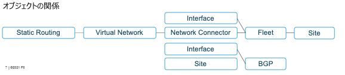

オブジェクトの関係図

Site Interface
==============================================

CE Siteのインタフェース設定 – Inside Interface
※Outside Interfaceの基本設定はSite構築時に作成済。

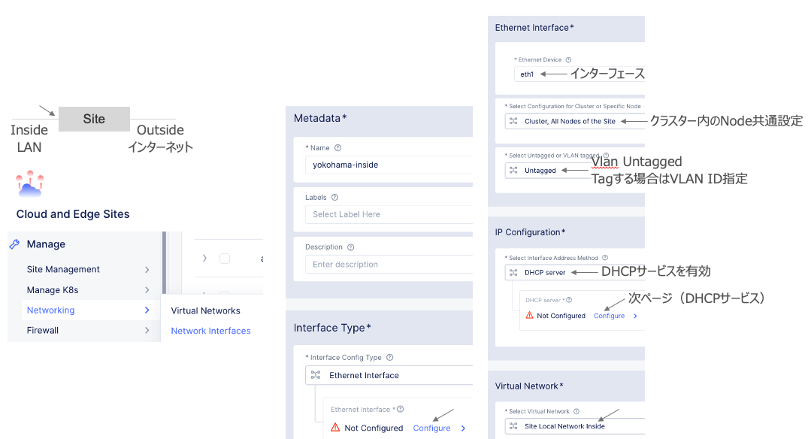

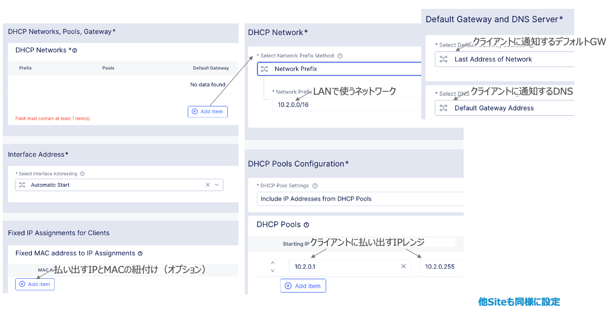

CE Siteのインタフェース設定 – Outside Interface
OutsideインタフェースでBGP Peerを張る場合に設定

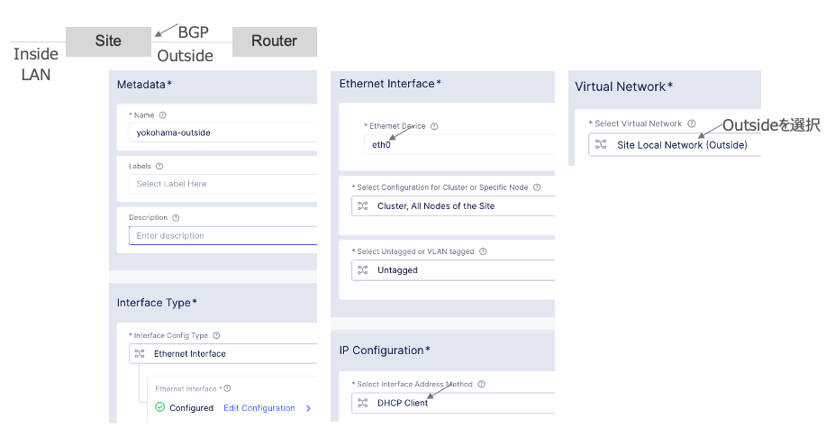

Virtual Network
==============================================

Site間でLAN-to-LAN通信をしたり、Siteからインターネットへアクセスするためのオーバーレイネットワーク。

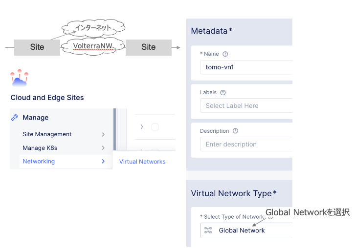

Network Connector
==============================================

Site間でLAN-to-LAN接続するために、SiteのInsideとVirtual Networkをコネクト。

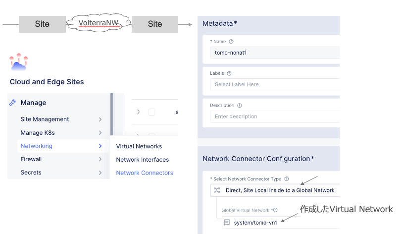

SiteのInsideとインターネット接続。

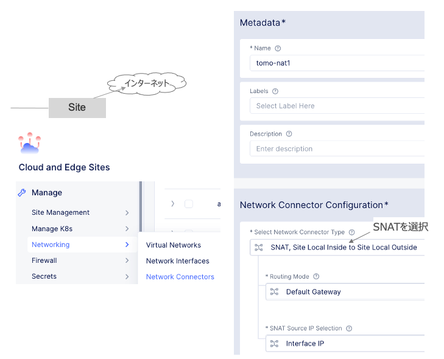

Fleet
==============================================

作成したInterfaceとNetwork Connector（Virtual Network指定済み）をSiteへ設定。

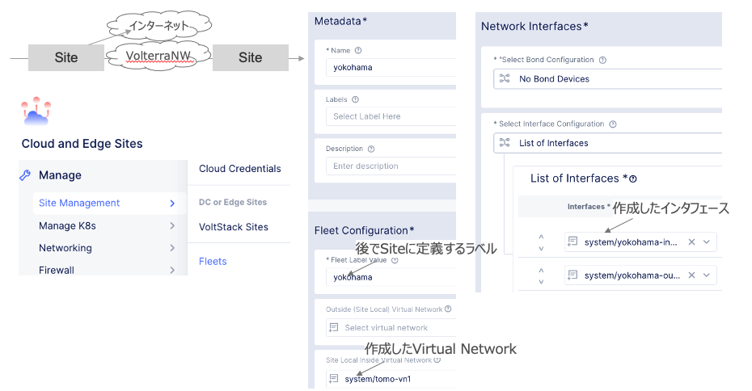

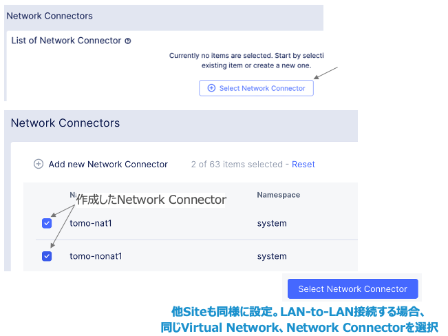

作成したFleetをSiteへ定義（Siteへ設定が反映される）

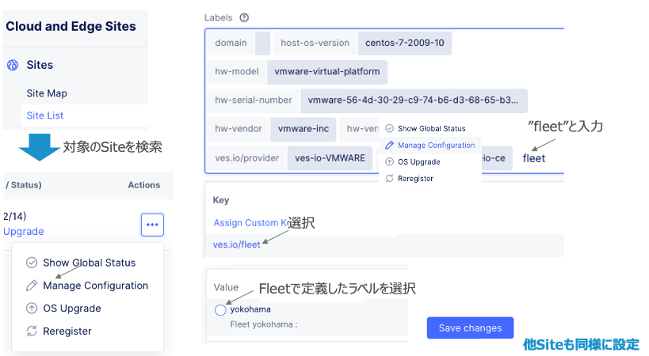

ローカルクライアントのNode冗長
==============================================
ローカルクライアントからのアクセスはデフォルトGWの冗長で切り替わる

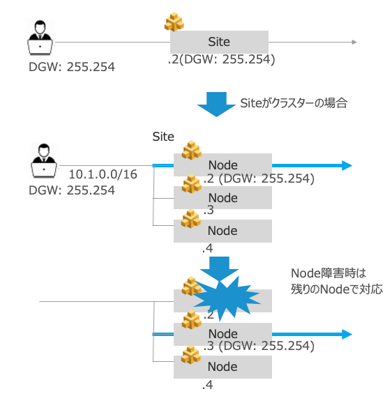

Routing BGP​
==============================================

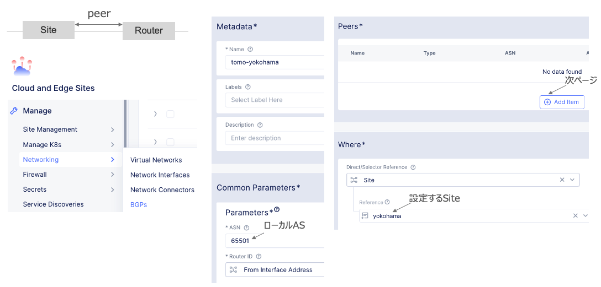

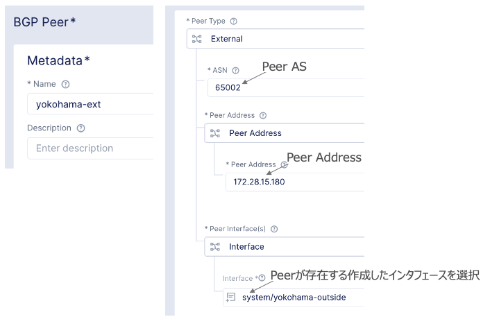

BGPによるRoute冗長
==============================================

Siteがクラスター構成の場合、同じルートを各Nodeから配信し、ルート冗長が取れる。

Static Route
==============================================
Virtual Networkで定義。

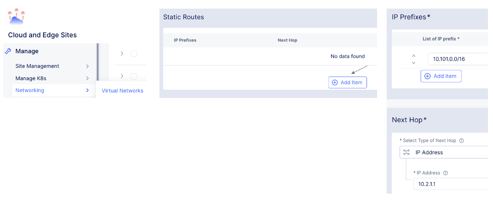

Site Mesh Group
==============================================
ユーザデータのみSite-to-Siteで直接通信。コントロールプレーンはVolterra REを使用。

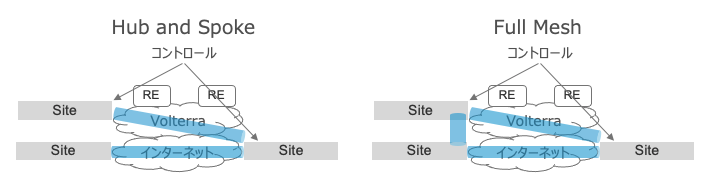

条件
・ Spokeは複数Hubと接続できる。
・ Hub Siteは別グループのSpokeになれるが、同一グループのHub兼Spokeになれない。
・ IPSec-VPNのみ有効、SSL-VPNはサポートしない。
・ Path MTU Discoveryはサポートしない。
Spokeがトンネル構築のInitiator、HubがResponderの役割を担う。
トンネルで使うIPアドレスがプライベートIPの場合、Responder側でUDP4500（NATトラバース）をポートマッピングする。

Site Mesh Group用のラベルを作成。

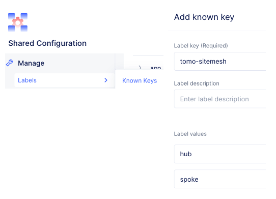

HubとSpoke用のSiteを各々Virtual Siteでグルーピング。

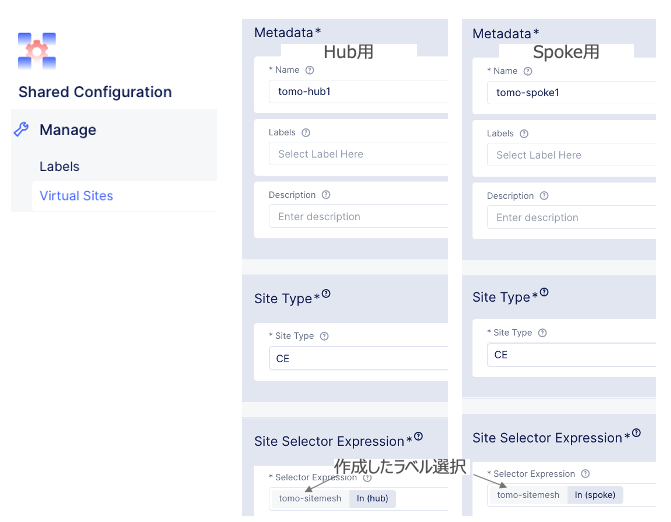

IPSec VPNのトンネルIPアドレスとラベルを定義。

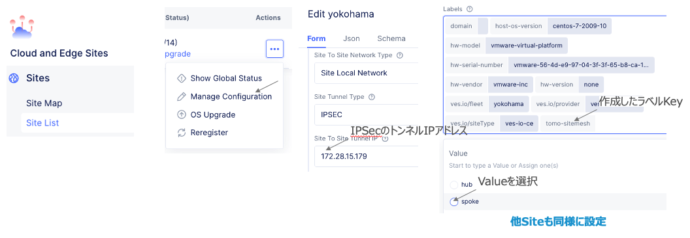

Site Mesh Group作成

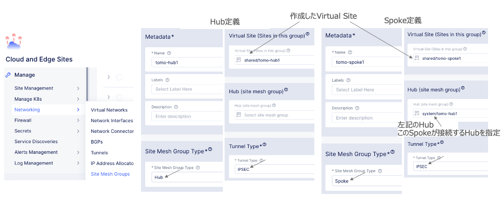

ステータス確認
==============================================

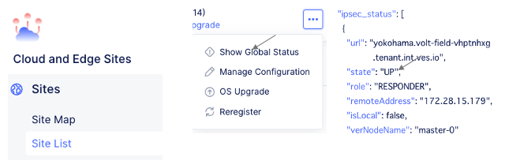

 