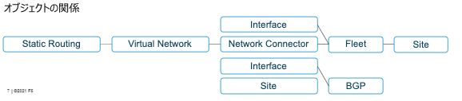

==============================================
Network - Cloud and Edge Site
==============================================

Networkを構成する要素
==================
+--------------------------+------------+
|要素                       |概要                                                                           |
+==========================+============+
|Site Interface​            |SiteのInside（LAN）、Outside（Internet）のIPアドレス、DHCPサーバ、DNSの指定等。|
+--------------------------+------------+
|Virtual Network​           |Global Network（オーバーレイネットワーク）。Site-to-Site接続等で使用。​|
+--------------------------+------------+
|Network Connector​         |SiteのInside Local NetworkとGlobal Network等を接続。SNATやForward Proxyの有無を設定。|
+--------------------------+------------+
|Fleet                   ​  |上記要素をSiteへ定義するパラメータの集合体。Fleetのラベルを発行しSiteへ付ける。​|
+--------------------------+------------+
|疎通確認​                   |...|
+--------------------------+------------+
|ローカルクライアントのNode冗長​||
+--------------------------+------------+
|Routing BGP​               |SiteのInside/Outsideアンダーレイで接続するBGP Peer​|
+--------------------------+------------+
|BGPによるルート冗長​          |...|
+--------------------------+------------+
|Static Route​              |SiteのInside/OutsideアンダーレイでStatic Routingで接続​|
+--------------------------+------------+
|Site Mesh Group​           |Site間でフルメッシュまたはハブアンドスポークでIPSec接続すること。Volterra REを経由しない通信。|
+--------------------------+------------+

オブジェクトの関係図
==============================================
