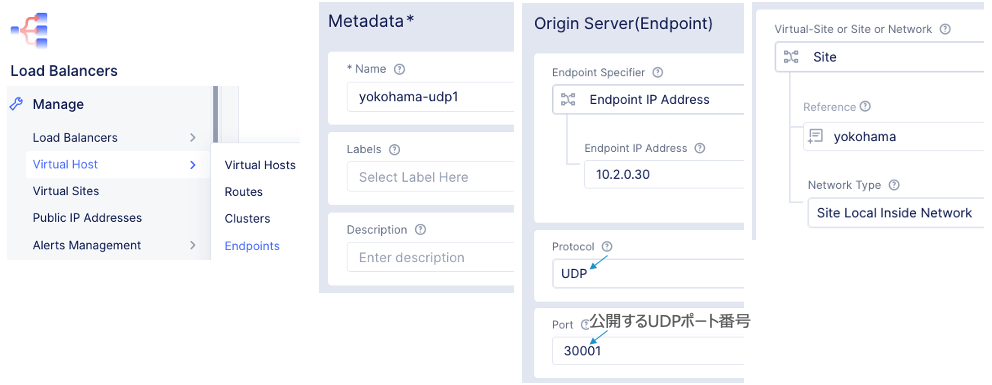

==============================================
Load Balancing
==============================================

Origin Pool​
==============================================

Load BalancingするエンドポイントをOrigin Server、その集合体をOrigin Poolと呼ぶ。

​
Origin Serverの種類

.. list-table::
    :header-rows: 1
    :stub-columns: 0

    * - 種類
      - 説明
    * - IP Address
      - パブリック/プライベートのIPアドレス
    * - DNS Name
      - パブリック/プライベートのFQDN
    * - Service Name
      - K8sまたはConsulのサービス名

サービスのポート番号を指定
ロードバランスアルゴリズムを指定

Load Balancing Control
==============================================

| Origin Poolは単一または複数Site内のサービス、各Siteの単一または複数サービスを指定できる。
| Load Balancerは単一または複数のOrigin Poolを指定できる。

Load Balancer Algorithm（LB）

.. list-table::
    :header-rows: 1
    :stub-columns: 0

    * - アルゴリズム
      - 概要
    * - Round Robin
      - 順番にエンドポイントを選択
    * - Least Active Request
      - 有効なリクエスト数が少ないエンドポイント
    * - Random
      - ランダムにエンドポイントを選択
    * - Source IP Stickiness
      - 送信元IPで宛先エンドポイントを維持
    * - Cookie Based Stickiness
      - Cookieを挿入し宛先エンドポイントを維持
    * - Ring Hash Policy
      - Consistent Hashing実装でEndpointの増減時に既存分散通信への影響を少なくする

Load Balancer Algorithm（OP）

.. list-table::
    :header-rows: 1
    :stub-columns: 0

    * - アルゴリズム
      - 概要
    * - Round Robin
      - 順番にエンドポイントを選択
    * - Least Active Request
      - 有効なリクエスト数が少ないエンドポイント
    * - Random
      - ランダムにエンドポイントを選択
    * - Ring Hash Policy
      - Consistent Hashing実装でEndpointの増減時に既存分散通信への影響を少なくする
    * - Load Balancer Override
      - LBのアルゴリズムに委任する。SourceIPやCookieでPersistenceする場合はこれを選択。

LB配置とVIP公開 – HTTP/HTTPS
==============================================

| LBは各SiteやVolterra REなどへ自由に配置。
| クライアントがアクセスするLBの仮想IPをVIPと呼ぶ。VIPはインターネット、またはイントラネットに公開される。
| 分散先のOrigin Poolを選択。ロードバランスアルゴリズムを指定

.. list-table::
    :header-rows: 1
    :stub-columns: 0

    * - VIP
      - 説明
    * - Advertise on Internet
      - VolterraのグローバルIPでインターネットへ公開。RE経由の通信。
    * - Advertise on Internet(Specified VIP)
      - 追加されたVolterraのグローバルIPでインターネットへ公開。RE経由の通信。
    * - Advertise Custom
      - ユーザのグローバルIPでインターネット、プライベートIPでイントラへ公開。

​

VIPの名前解決 – HTTP/HTTPS
==============================================
​
VIPに対するDomainの指定。

.. list-table::
    :header-rows: 1
    :stub-columns: 0

    * - VIP
      - 項目
      - 説明
    * - Advertise on Internet
      - * - HTTP
          - HTTPS
      - * - Volterraが仮のDomainを発行するので、DNSプロバイダのCNAMEレコードに登録。
          - Sub DomainをVolterraへ委任する。DNSプロバイダのNSレコードに登録。
    * - | Advertise Custom
        | （HTTP/HTTPS共通）
      - * - インターネット
          - イントラネット
      - * - DNSプロバイダのAレコードに登録。
          - Volterraの内部DNSが自動でAレコードを登録

​

Namespace
==============================================
​
Load BalancerはNamespace毎に作るため、まずはNamespaceを作成。

Origin Pool
==============================================
​
同一Site内の複数サービス、複数Siteのサービスを負荷分散対象としてグルーピング

.. figure:: images/image-04-07.png
  :width: 1080

エンドポイントのヘルスチェック

HTTPS LB – イントラネット
==============================================
​
| イントラに公開するサービスのDomainを定義。
| TLS用の証明書と秘密鍵の登録。

TLS用の証明書、秘密鍵の登録

Origin Poolの選択とVIP（LB）の配置。

HTTPS LB – インターネット
==============================================
​
| インターネットへVIPを公開する手法は２つ。
| ① Volterra REで公開
| ② Siteで公開

HTTPS LB – インターネット（RE経由）
==============================================
​
インターネットへ公開するサービスの仮Domainを定義。TLSの証明書と鍵はVolterraが自動生成。

Origin PoolとVIPを設定。

設定したDomainをDelegation。

HTTPS LB – インターネット（Site直）
==============================================
​
インターネットへ公開するサービスの仮Domainを定義。TLSの証明書と鍵はVolterraが自動生成。

TLS用の証明書、秘密鍵の登録

Origin Poolの選択とVIP（LB）の配置。

LBに複数FQDN指定
==============================================
​
一つのロードバランサに複数FQDNを指定できる。

HTTPS Origin Server
==============================================
​
Origin ServerがHTTPSサービスの場合TLS処理する。

ロードバランシング – Active/Standby
==============================================
​
| Active/Standbyの手法は2つ。
| ① Origin Pool間でActive/Standby
| ② Origin Server間でActive/Standby

Origin Pool間

| Origin Server間
| Origin ServerにActive/Standbyのラベルを定義。

Origin PoolでActiveとStandbyのEndpointを追加

Origin PoolでActive/Standby用のSubset LBを有効。

Load BalancersでActive/Standby用のRouteを設定

.. figure:: images/image-04-31.png
  :width: 1080

AnycastIP広報によるSite冗長
==============================================
​
各Siteで同じVIPを設定し外部へAnycastとして広報すると、クライアントは一番近いSiteへアクセス。Site障害時は別のSiteへアクセス。

BGPによるVIP冗長
==============================================
​
SiteがBGPを使うとLB VIPを自動で伝搬。

ローカルクライアントのNode冗長
==============================================
​
| ローカルクライアントからのアクセスはVIPではなくDNSで冗長される。

| $ nslookup vk8s.tokyo.com
| Name:	vk8s.tokyo.com
| Address: 10.1.0.2

| 障害発生時
| $ nslookup vk8s.tokyo.com
| Name:	vk8s.tokyo.com
| Address: 10.1.0.3

TCP LoadBalancing
==============================================
​
設定手順は基本的にHTTP LBと同じ。Origin Poolを事前に定義。

UDP LoadBalancing
==============================================
​
Orign ServerとなるEndpointを定義。

複数のEndpointをClusterとして定義。

ClusterへのRouteを定義。

UDP LBを作成。

